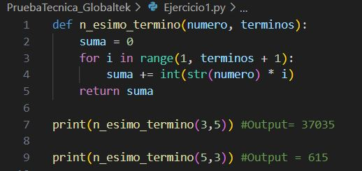
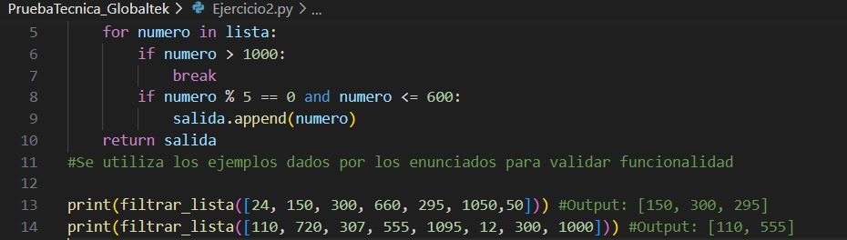
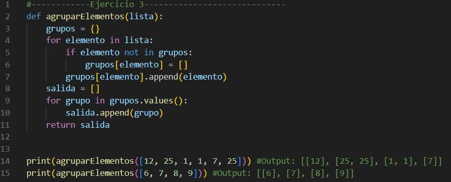
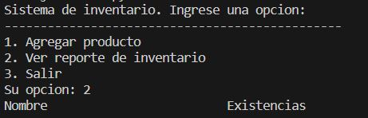
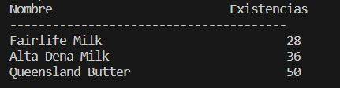
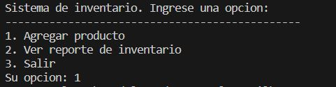
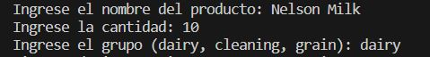
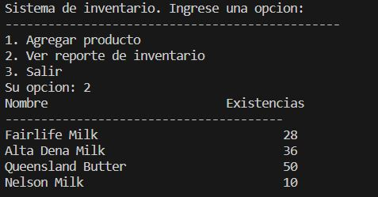

# PruebaTecnica_Globaltek

Prueba tecnica resuelta por: Nelson Gonzalez Contreras

## Ejercicio 1:

La solución del ejercicio consiste en una función que se llama n_esimo_termino que toma dos argumentos, para calcular la suma de una serie de un numero hasta el n-ésimo termino definido.Donde dentro de la funcion se inicializa una variable llamada suma = 0, despues se inicializa un bucle for para iterar el rango de valores desde que i =1 hasta el numero de terminos indicado + 1. Por cada iteración se calcula el valor del termino actual de la serie multiplicando el numero por una cadena de caracteres que contiene el número repetido i veces. Este valor se convierte a un entero y se suma a la variable suma.

Finalmente retorna el valor de la variable suma, que sera la suma de todos los terminos de la serie.

## Ejercicio 2:

Se utiliza una funcion filtrar_lista donde tomara un parametro de entrada lista dentro de la funcion se inicia una lista vacia que almacenara los elementos que cumplan dicha condicion. Se inicializa un bucle for para iterar por cada elemento del arreglo insertado. En cada iteración del bucle, se verifica si el número es mayor que 1000. Si es así, se detiene el procesamiento y se retorna el resultado. Si el número no es mayor que 1000, se verifica si es divisible por cinco y si es menor o igual a 600. Si cumple con ambas condiciones, se agrega a la lista salida. 

Finalmente, después de que el bucle haya terminado, la función retorna la lista salida.

## Ejercicio 3:

La función agruparElementos toma como argumento una lista de cualquier longitud. Dentro de la función, se inicializa un diccionario vacio llamado grupos donde almacenará los elementos similares. En cada iteración del bucle, se verifica si el elemento ya está en el diccionario grupos. Si no está, se agrega una nueva entrada al diccionario con el elemento como clave y una lista vacía como valor. Luego, se agrega el elemento a la lista correspondiente en el diccionario grupos. Después de que el bucle haya terminado, se inicializa una lista vacía llamada salida y se utiliza otro bucle for para iterar sobre los valores del diccionario grupos. En cada iteración del bucle, se agrega el valor (que es una lista con los elementos similares agrupados) a la lista salida. Finalmente, después de que el segundo bucle haya terminado, la función retorna la lista salida.

## Ejercicio 4:
Este programa permite organizar el inventario en los grupos dairy, cleaning y grain. Cada grupo tiene asociado una lista de productos y una lista de existencias. El programa tiene una función llamada agregar_producto que permite registrar un producto entrante en el sistema, especificando su nombre, cantidad y grupo. Si el producto no existe en la lista correspondiente, se agrega al final con su cantidad entrante. Si el producto ya existe en la lista, se actualiza el número de existencias sumando la nueva cantidad.

Verificamos la funcionalidad del programa

El programa también tiene una función llamada ver_reporte que permite visualizar todo el inventario de productos y existencias. Esta función muestra en pantalla una tabla con los nombres de los productos y sus existencias.

Finalmente, el programa tiene un menú principal que permite al usuario seleccionar una opción para agregar un producto o ver el reporte de inventario. Si el usuario selecciona la opción 1

se le pide que ingrese el nombre del producto, la cantidad y el grupo al que pertenece. 

Luego, se llama a la función agregar_producto para registrar el producto en el sistema. 

Si el usuario selecciona la opción 2, se llama a la función ver_reporte para mostrar en pantalla el reporte de inventario. Si el usuario selecciona la opción 3, se termina la ejecución del programa.

